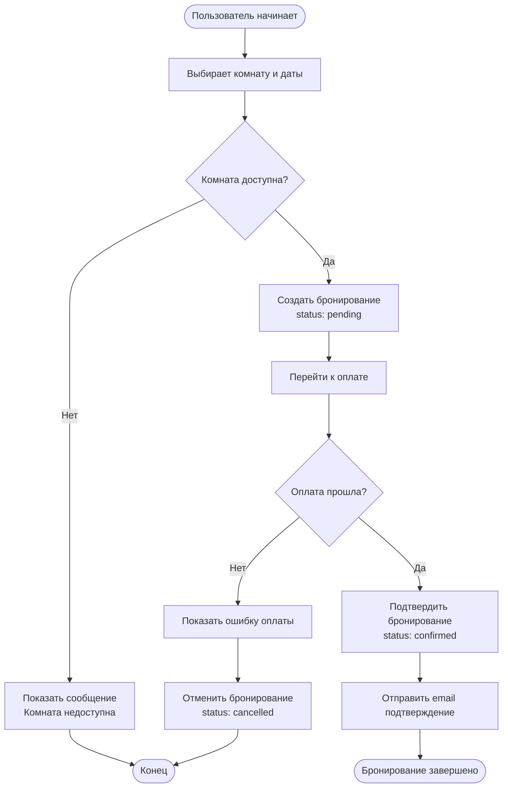
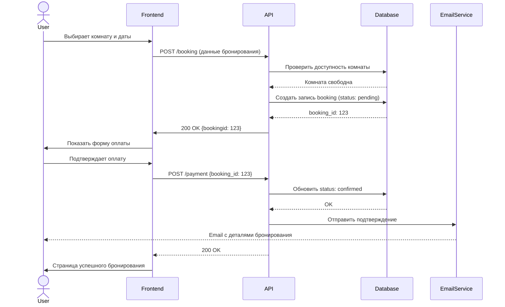
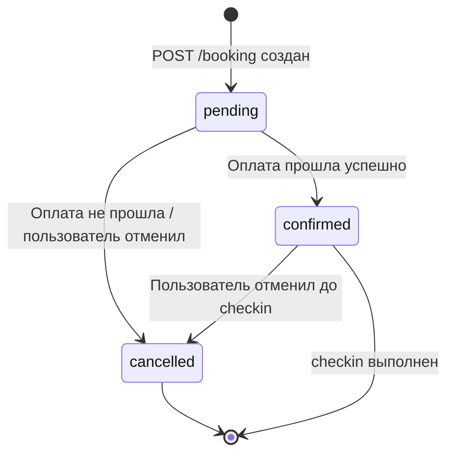

# Диаграммы — Процесс бронирования

## 1. BPMN — Happy path + 2 исключения

## 2. Sequence Diagram — Создание бронирования

## 3. State Transition — Переходы состояний Booking

## Переходы которые нужно покрыть тестами

| Переход | Почему важно тестировать |
|---|---|
| [*] → pending | Основной happy path, создание бронирования |
| pending → confirmed | Критичный бизнес-переход, подтверждение оплаты |
| pending → cancelled | Негативный сценарий, откат при ошибке оплаты |
| confirmed → cancelled | Отмена подтверждённого бронирования, возврат средств |
| confirmed → [*] | Завершение бронирования после checkin |